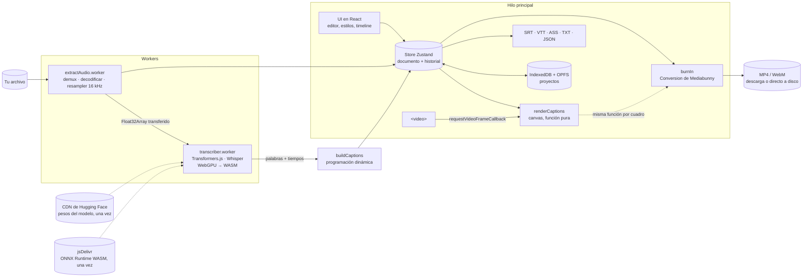

# Letritas: subtítulos animados con IA, 100% en tu navegador

**Español** · [English](README.md)

Arrastras un video, Whisper lo transcribe **en tu propia computadora** (WebGPU, con respaldo en
WASM), corriges el texto, eliges un estilo y exportas los subtítulos o el video con los subtítulos
quemados. **Ningún archivo se sube a un servidor.** Gratis, privado y funciona sin internet
después de la primera visita.

**Demo en vivo:** https://letritas.pages.dev _(actualiza este link tras tu primer deploy; ver [Deploy](#deploy-gratis))_


> El GIF usa el clip de ejemplo («Probar con un video de ejemplo»), cuya transcripción viene
> precalculada para que nadie tenga que descargar un modelo para verlo. Todo lo demás (forma de
> onda, editor, renderizador y exportación de video) corre de verdad en el navegador.

## Funciones

|                         |                                                                                                                                                                                                                                                                                                                                                                         |
| ----------------------- | ----------------------------------------------------------------------------------------------------------------------------------------------------------------------------------------------------------------------------------------------------------------------------------------------------------------------------------------------------------------------- |
| **Carga**               | MP4, MOV, WEBM, MP3, WAV, M4A. El audio se extrae con Mediabunny, se decodifica con WebCodecs y se convierte a 16 kHz mono **en un worker y por bloques** (un video de 1 h no necesita 1.4 GB de RAM). Si falla, usa `decodeAudioData`.                                                                                                                                 |
| **Transcripción local** | Whisper `tiny` / `base` / `small` (exportaciones ONNX "_timestamped" → **timestamps por palabra**) con Transformers.js 4 en un Web Worker. WebGPU con respaldo automático a WASM. Español, inglés o **detección automática del idioma** (implementada a mano, ver abajo). Muestra el peso real de descarga, si ya está descargado y la velocidad medida en _tu_ equipo. |
| **Líneas inteligentes** | Las palabras se agrupan con **programación dinámica** (como el algoritmo Knuth–Plass para párrafos): máximo de caracteres por línea (distinto en vertical y horizontal), máximo 2 líneas, duración mínima y máxima, cortes en pausas y puntuación, nunca después de "de" o "la", líneas balanceadas y velocidad de lectura cómoda (17 caracteres/s).                    |
| **Editor**              | Corrige el texto (los tiempos se redistribuyen con un diff LCS), divide, une y elimina, arrastra subtítulos y sus bordes sobre una **forma de onda en canvas**, busca y reemplaza, **deshacer/rehacer** (snapshots + structural sharing + agrupación), atajos de teclado (`?`), clic en una palabra para saltar a ese momento.                                          |
| **Estilos**             | Presets _Clásico_, _TikTok_ (grande, mayúsculas, palabra por palabra con resaltado y "pop"), _Karaoke_ (relleno progresivo) y _Minimal_. Fuente (Google Fonts OFL alojadas en el propio sitio), tamaño, colores, contorno, sombra, caja de fondo, posición, animaciones, **zonas seguras de TikTok/Reels/Shorts**, emojis automáticos (dinero → 💰).                    |
| **Vista previa exacta** | Un solo renderizador en canvas sincronizado con `requestVideoFrameCallback`. **La misma función** dibuja cada cuadro exportado: lo que ves es lo que exportas.                                                                                                                                                                                                          |
| **Exportar**            | SRT, VTT, ASS (con estilos y karaoke `\kf`), texto plano, JSON con tiempos por palabra y **MP4 con subtítulos quemados**, generado en el navegador con WebCodecs + Mediabunny, con progreso, tiempo restante y cancelar. Si no puede codificar H.264, ofrece WebM (VP9/VP8/AV1) o los archivos de subtítulos. Un audio se convierte en un "audiograma" vertical.        |
| **Proyectos y offline** | Proyectos con autoguardado (IndexedDB para los datos, **OPFS** para el video). **PWA** instalable que funciona sin internet una vez descargado el modelo.                                                                                                                                                                                                               |

## Stack

TypeScript (estricto, `noUncheckedIndexedAccess`) · React 19 · **Vite 8** · Tailwind CSS 4 · Zustand ·
**Transformers.js 4** (ONNX Runtime Web: WebGPU/WASM) · **Mediabunny** + WebCodecs · Web Workers ·
IndexedDB (`idb`) + OPFS · vite-plugin-pwa (Workbox) · Fontsource · Vitest · Playwright ·
GitHub Actions · Cloudflare Pages.

## Arquitectura



Las únicas peticiones de red son el sitio estático, los pesos del modelo (Hugging Face) y el binario
de ONNX Runtime (jsDelivr). Se descargan una vez y quedan en caché, y **ninguna lleva tu video ni
tu texto.** Un test E2E falla si alguna petición sale del origen mientras trabajas en un video.

## Benchmarks

Córrelos en tu equipo con `npm run build && npm run bench`. Usa tu Google Chrome con WebGPU real y
la primera vez descarga los modelos. El resultado queda en `bench/results.md`.

**Transcribir 60 s de voz en español**, _pendiente de llenar con `npm run bench` en mi laptop:_

| Modelo | Dispositivo | Carga (s) | Transcribir 60 s (s) | × tiempo real |
| ------ | ----------- | --------: | -------------------: | ------------: |
| tiny   | WebGPU      |           |                      |               |
| base   | WebGPU      |           |                      |               |
| small  | WebGPU      |           |                      |               |
| tiny   | WASM        |           |                      |               |
| base   | WASM        |           |                      |               |
| small  | WASM        |           |                      |               |

**Exportar 60 s de video 1080×1920 a 30 fps con subtítulos estilo TikTok:**

| Equipo                                                                     | Contenedor | Códec | Tiempo (s) | FPS |
| -------------------------------------------------------------------------- | ---------- | ----- | ---------: | --: |
| Mi laptop _(por llenar)_                                                   | MP4        | H.264 |            |     |
| Mi laptop _(por llenar)_                                                   | WebM       | VP9   |            |     |
| Contenedor de CI (4 vCPU, Chromium 141 headless, codificador por software) | WebM       | VP9   |       14.0 | 128 |

## Compatibilidad por navegador

Letritas detecta lo que soporta el navegador al arrancar y siempre ofrece una salida.

|                                       | Chrome / Edge 113+                                    | Firefox 141+                            | Safari 26+                    |
| ------------------------------------- | ----------------------------------------------------- | --------------------------------------- | ----------------------------- |
| Transcripción con **WebGPU**          | ✅ (en Linux depende de GPU/driver)                   | ✅ en Windows; otros sistemas en camino | ✅                            |
| Transcripción con **WASM** (respaldo) | ✅ multihilo                                          | ✅ multihilo                            | ✅ multihilo                  |
| Decodificar audio                     | WebCodecs                                             | WebCodecs                               | WebCodecs o `decodeAudioData` |
| Exportar **MP4 (H.264)**              | ✅ (no en builds de Chromium sin códecs propietarios) | depende del codificador del sistema     | ✅                            |
| Exportar **WebM**                     | ✅                                                    | ✅                                      | depende de la versión         |
| Exportar directo a disco              | ✅ (File System Access API)                           | — (en memoria)                          | — (en memoria)                |

_Verificado automáticamente en CI: Chromium (ruta WebM, transcripción simulada). El resto se basa
en el soporte de cada API; si algo no coincide, abre un issue._

## Decisiones técnicas y sus trade-offs

- **Vite + React en lugar de Next.js.** No hay servidor: nada que renderizar en el servidor, sin
  API routes y sin SEO por página. Lo fuerte de Next no aplica aquí, y los workers como módulos, el
  WASM y los headers son más simples en Vite. Trade-off: no aparece "Next.js" en el CV, pero
  explicar por qué no lo usé vale más.
- **Todo lo pesado en workers.** Extraer el audio y Whisper nunca tocan el hilo principal. Cancelar
  una transcripción termina el worker, porque ONNX Runtime no se puede interrumpir a mitad de una
  inferencia; el modelo se recarga desde la caché en segundos.
- **Detección de idioma hecha a mano.** Los tipos de Transformers.js dicen que `language: null` lo
  detecta solo, pero el código usa inglés en silencio. Corro el encoder sobre 30 s de voz, le paso
  solo `<|startoftranscript|>` al decoder y aplico softmax a los logits de los tokens de idioma,
  como hace `detect_language()` en Python.
- **Precisión en WebGPU:** encoder en fp32 + decoder de 4 bits. El decoder corre una vez por token,
  así que es el cuello de botella, y los decoders fp16 fallan en WebGPU. En WASM todo va a 8 bits.
- **Resampler sinc con ventana, en streaming**, en lugar de `OfflineAudioContext`: funciona dentro de
  un worker y la memoria depende de la salida a 16 kHz, no de la entrada a 48 kHz estéreo.
- **Armado de líneas con programación dinámica** en vez de llenar línea por línea: el método
  "greedy" no puede ver hacia adelante, así que termina subtítulos en "de" o corta mal las frases.
  Costo = penalizaciones; complejidad O(n·k).
- **Deshacer/rehacer con snapshots inmutables**, no con el patrón Command: es más simple, no se puede
  desincronizar y sale barato gracias al structural sharing (una edición solo reemplaza un
  subtítulo). Los arrastres son transitorios y se guardan como un solo paso al soltar.
- **Un solo renderizador para vista previa y exportación** → WYSIWYG por construcción. Todas las
  medidas son relativas al alto del cuadro. La exportación corre en el hilo principal a propósito:
  ahí están cargadas las fuentes (`FontFace` en workers no es uniforme entre navegadores), y
  WebCodecs codifica en sus propios hilos.
- **Fuentes alojadas en el propio sitio (Fontsource)** en vez del CDN de Google Fonts: cargarlas de
  Google le mandaría la IP de cada visitante a Google, lo que contradice la promesa de privacidad,
  y además no funcionarían offline.
- **OPFS para el video, IndexedDB para los datos:** guardar blobs grandes en IndexedDB es lento y
  frágil.
- **Aislamiento cross-origin (COOP/COEP)** para habilitar `SharedArrayBuffer` → WASM multihilo.
- **No se despliega el WASM de 26 MB de ONNX Runtime**: Vite lo copia al build, pero
  Transformers.js lo carga desde jsDelivr. Un plugin pequeño de Vite lo descarta para no pasar el
  límite de 25 MiB por archivo de Cloudflare Pages.
- **Transcriptor simulado para E2E**, elegido en tiempo de build (`--mode e2e`) y eliminado de
  producción por tree-shaking (verificado: el texto del mock no aparece en `dist/`).
- **ASS ≠ Premiere/DaVinci:** esos editores importan SRT (texto y tiempos). El ASS conserva los
  estilos para FFmpeg, VLC, mpv, Aegisub y Kdenlive; para redes sociales, exporta el MP4 quemado.

## Correrlo localmente

Requisitos: Node.js 22+.

```bash
npm install
npm run dev          # http://localhost:5173
```

No hace falta ninguna variable de entorno porque no hay backend. Revisa `.env.example` para los
ajustes opcionales.

## Tests

```bash
npm run lint         # ESLint (typescript-eslint estricto, con tipos)
npm run typecheck    # tsc --noEmit
npm test             # Vitest: líneas, redistribución de tiempos, deshacer/rehacer, snapshots de SRT/VTT/ASS…
npm run test:e2e     # Playwright con transcriptor simulado (lo que corre el CI)
npm run test:real    # Playwright con el modelo Whisper REAL (lo descarga; correr en local)
npm run bench        # benchmarks → bench/results.md
```

Cobertura E2E: cargar → transcribir → editar (texto, dividir/unir, buscar/reemplazar, arrastrar en
el timeline, deshacer/rehacer) → estilos → exportar SRT/VTT/ASS y video quemado (respaldo WebM,
audiograma, cancelar) → autoguardar y reabrir proyectos → PWA offline → **privacidad (ninguna
petición sale del origen)**.

En contenedores sin el navegador de Playwright, indícale un Chromium con
`PW_CHROMIUM_EXECUTABLE=/ruta/a/chromium`.

## Deploy gratis

**Cloudflare Pages** (plan gratis, ancho de banda ilimitado y headers propios vía `public/_headers`):

1. Sube el repositorio a GitHub.
2. En el dashboard de Cloudflare: **Workers & Pages → Create → Pages → Connect to Git** y elige el repo.
3. Configuración de build: framework preset **None**, comando `npm run build`, carpeta de salida
   `dist`. En _Environment variables_ agrega `NODE_VERSION = 22`.
4. **Save and Deploy.** Cada push a la rama principal redespliega, y los pull requests reciben una
   URL de vista previa.
5. En la consola del navegador del sitio desplegado, revisa que `crossOriginIsolated` sea `true`
   (los headers COOP/COEP vienen de `public/_headers`).
6. Actualiza el link de la demo al inicio de ambos READMEs.

No se necesita ningún secreto: Cloudflare construye directo desde el repo.

**Vercel** también funciona (`vercel.json` pone los mismos headers): importa el repo, framework
_Vite_, build `npm run build`, salida `dist`.

## Cómo usé IA

_Este proyecto lo construí en pair programming con **Claude Code** (Anthropic)._

**Qué hizo Claude Code:** propuso el plan por fases y el stack (incluido Vite en lugar de Next.js);
leyó las versiones instaladas de Transformers.js 4 y Mediabunny para escribir código contra sus APIs
reales (así encontró el bug de "inglés por defecto"); implementó el pipeline, el editor, el
renderizador, los exportadores, la PWA y los tests; corrigió bugs que los propios tests destaparon
(faltaban espacios entre palabras en la lista, una carrera al cancelar la exportación antes de que
empezara, conexiones de IndexedDB que bloqueaban la limpieza de los tests); generó el clip de
ejemplo, los íconos, el GIF y esta documentación.

**Qué decidí o corregí yo:** _TODO(Marvin): escribe esta sección tú mismo: qué decisiones tomaste,
qué cambiaste, qué revisaste y qué aprendiste. Te lo van a preguntar en las entrevistas._

## Ejercicios pendientes para mí (`TODO(Marvin)`)

| Fase | Dónde                                          | Qué                                                                                          |
| ---- | ---------------------------------------------- | -------------------------------------------------------------------------------------------- |
| 1    | `src/lib/transcription/hallucinations.ts`      | Quitar las alucinaciones de Whisper ("Subtítulos realizados por la comunidad de Amara.org"). |
| 2    | `src/lib/captions/search.ts` → `foldForSearch` | Búsqueda que ignore acentos ("cancion" encuentra "canción").                                 |
| 3    | `src/lib/render/emojis.ts` → `pickEmoji`       | Emojis más tolerantes (puntuación, acentos, plurales).                                       |
| 4    | `src/lib/exportVideo/eta.ts`                   | Un tiempo restante más estable (velocidad reciente o media móvil).                           |
| 5    | Este README                                    | La sección "Qué decidí o corregí yo".                                                        |

Cada uno tiene pistas en el código y tests pendientes (`it.todo`) para convertir en tests reales.

## Licencia

MIT. Las fuentes usan la SIL Open Font License 1.1 (vía Fontsource). Modelos Whisper: MIT (OpenAI).
