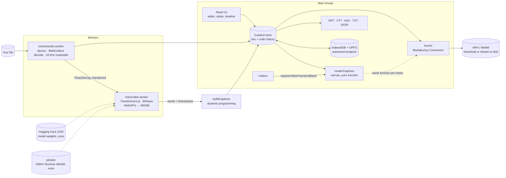

# Letritas — animated captions with AI, 100% in your browser

[Español](README.es.md) · **English**

Drop a video, Whisper transcribes it **on your own computer** (WebGPU, with a WASM fallback),
fix the text, pick a style, and export subtitle files or the video with the captions burned in.
**No file is ever uploaded to a server.** Free, private, works offline after the first visit.

**Live demo:** https://letritas.pages.dev _(update this link after your first deploy — see [Deploy](#deploy-free))_


> The GIF uses the built-in sample clip ("Probar con un video de ejemplo"), whose transcript is
> precomputed so visitors don't have to download a model. Everything else in the GIF — waveform,
> editor, renderer and video export — runs for real in the browser.

## Features

|                         |                                                                                                                                                                                                                                                                                                                                                                          |
| ----------------------- | ------------------------------------------------------------------------------------------------------------------------------------------------------------------------------------------------------------------------------------------------------------------------------------------------------------------------------------------------------------------------ |
| **Load**                | MP4, MOV, WEBM, MP3, WAV, M4A. Audio is demuxed with Mediabunny, decoded with WebCodecs and resampled to 16 kHz mono **in a worker, chunk by chunk** (a 1 h video doesn't need 1.4 GB of RAM). Falls back to `decodeAudioData` when needed.                                                                                                                              |
| **Local transcription** | Whisper `tiny` / `base` / `small` ("_timestamped" ONNX exports → **word-level timestamps**) with Transformers.js 4 in a Web Worker. WebGPU, automatic WASM fallback. Spanish, English or **automatic language detection** (implemented by hand, see below). Real download size and "already downloaded" status per model; speed measured on _your_ device is remembered. |
| **Smart lines**         | Words are grouped into captions with **dynamic programming** (like Knuth–Plass line breaking): max characters per line (different for vertical/horizontal), max 2 lines, min/max duration, breaks at pauses and punctuation, never after "de"/"the", balanced lines, comfortable reading speed (17 cps).                                                                 |
| **Editor**              | Edit text (word timings are redistributed with an LCS diff), split/merge/delete, drag captions and their edges on a canvas **waveform timeline**, find & replace, **undo/redo** (snapshots + structural sharing + coalescing), keyboard shortcuts (`?`), click a word to seek.                                                                                           |
| **Styles**              | Presets _Clásico_, _TikTok_ (big, uppercase, word-by-word highlight with pop), _Karaoke_ (progressive fill) and _Minimal_. Font (self-hosted OFL Google Fonts), size, colors, outline, shadow, background box, position, animations, **TikTok/Reels/Shorts safe zones**, automatic keyword emojis (dinero → 💰).                                                         |
| **Exact preview**       | One canvas renderer synced with `requestVideoFrameCallback`. **The same function** draws every exported frame, so what you see is what you export.                                                                                                                                                                                                                       |
| **Export**              | SRT, VTT, ASS (styled, karaoke `\kf` tags), plain text, JSON with word timings — and **MP4 with burned-in captions** made in the browser with WebCodecs + Mediabunny, with progress, ETA and cancel. Falls back to WebM (VP9/VP8/AV1) when H.264 can't be encoded, or to subtitle files. Audio-only input becomes a vertical "audiogram".                                |
| **Projects & offline**  | Autosaved projects (IndexedDB for data, **OPFS** for media). Installable **PWA** that works offline once the model is downloaded.                                                                                                                                                                                                                                        |

## Stack

TypeScript (strict, `noUncheckedIndexedAccess`) · React 19 · **Vite 8** · Tailwind CSS 4 · Zustand ·
**Transformers.js 4** (ONNX Runtime Web: WebGPU/WASM) · **Mediabunny** + WebCodecs · Web Workers ·
IndexedDB (`idb`) + OPFS · vite-plugin-pwa (Workbox) · Fontsource · Vitest · Playwright ·
GitHub Actions · Cloudflare Pages.

## Architecture



The only network requests the app makes are the static site itself, the model weights (Hugging
Face) and the ONNX Runtime binary (jsDelivr) — downloaded once and cached. **None of them carries
your media or text.** An E2E test fails if any request leaves the origin while you work on a video.

## Benchmarks

Run them on your machine with `npm run build && npm run bench` (uses your Google Chrome with real
WebGPU; downloads the models the first time). Results go to `bench/results.md`.

**Transcription of 60 s of Spanish speech** — _to be filled in with `npm run bench` on my laptop:_

| Model | Device | Load (s) | Transcribe 60 s (s) | × realtime |
| ----- | ------ | -------: | ------------------: | ---------: |
| tiny  | WebGPU |          |                     |            |
| base  | WebGPU |          |                     |            |
| small | WebGPU |          |                     |            |
| tiny  | WASM   |          |                     |            |
| base  | WASM   |          |                     |            |
| small | WASM   |          |                     |            |

**Export of 60 s of 1080×1920 video at 30 fps with TikTok-style captions:**

| Machine                                                        | Container | Codec | Time (s) | FPS |
| -------------------------------------------------------------- | --------- | ----- | -------: | --: |
| My laptop _(to fill in)_                                       | MP4       | H.264 |          |     |
| My laptop _(to fill in)_                                       | WebM      | VP9   |          |     |
| CI container (4 vCPU, headless Chromium 141, software encoder) | WebM      | VP9   |     14.0 | 128 |

## Browser support

Letritas checks capabilities at runtime and always offers a way forward.

|                                      | Chrome / Edge 113+                                     | Firefox 141+                       | Safari 26+                               |
| ------------------------------------ | ------------------------------------------------------ | ---------------------------------- | ---------------------------------------- |
| Transcription on **WebGPU**          | ✅ (Linux depends on GPU/driver)                       | ✅ Windows; other OSes rolling out | ✅                                       |
| Transcription on **WASM** (fallback) | ✅ multi-threaded                                      | ✅ multi-threaded                  | ✅ multi-threaded                        |
| Audio decoding                       | WebCodecs                                              | WebCodecs                          | WebCodecs, or `decodeAudioData` fallback |
| Export **MP4 (H.264)**               | ✅ (not in Chromium builds without proprietary codecs) | depends on the OS encoder          | ✅                                       |
| Export **WebM**                      | ✅                                                     | ✅                                 | depends on version                       |
| Stream export to disk                | ✅ (File System Access API)                            | — (builds in memory)               | — (builds in memory)                     |

_Verified automatically in CI: Chromium (WebM path, WASM/mock transcription). The rest is based
on each API's support; please report anything that doesn't match._

## Technical decisions and trade-offs

- **Vite + React instead of Next.js.** There's no server: nothing to render on the server, no API
  routes, no per-page SEO. Next's strengths don't apply, while module workers, WASM and custom
  headers are simpler in Vite. Trade-off: no "Next.js" badge — but a reasoned choice is worth more.
- **Everything in workers.** Audio extraction and Whisper never touch the main thread.
  Cancelling a transcription terminates the worker (ONNX Runtime can't be interrupted
  mid-inference); the model reloads from cache in seconds.
- **Language detection done by hand.** Transformers.js' types say `language: null` auto-detects,
  but its code silently falls back to English. I run the encoder on 30 s of speech, feed only
  `<|startoftranscript|>` and softmax the language-token logits — what `detect_language()` does
  in Python.
- **WebGPU precision:** fp32 encoder + 4-bit decoder (the decoder runs once per token, so it's the
  bottleneck); fp16 decoders are known to break on WebGPU. WASM uses 8-bit everywhere.
- **Streaming windowed-sinc resampler** instead of `OfflineAudioContext`: works in a worker and
  needs memory proportional to the 16 kHz output, not the 48 kHz stereo input.
- **Line building with dynamic programming** instead of greedy filling: greedy can't "look ahead"
  and ends captions on "de" or splits sentences badly. Cost = penalties; O(n·k).
- **Undo/redo with immutable snapshots**, not a command pattern: simpler, impossible to get
  out of sync, and cheap thanks to structural sharing (an edit only replaces one caption).
  Drags are transient and committed as one step on release.
- **Single renderer for preview and export** → WYSIWYG by construction. All sizes are relative
  to the frame height. Export runs on the main thread on purpose: fonts are loaded there
  (`FontFace` in workers isn't consistent across browsers); WebCodecs encodes on its own threads.
- **Self-hosted fonts (Fontsource)** instead of the Google Fonts CDN: loading from Google would
  send every visitor's IP to Google (contradicting the privacy promise) and break offline use.
- **OPFS for media, IndexedDB for data:** big blobs in IndexedDB are slow and fragile.
- **Cross-origin isolation (COOP/COEP)** enables `SharedArrayBuffer` → multi-threaded WASM.
- **The 26 MB ONNX Runtime WASM is not deployed**: Vite copies it into the build, but
  Transformers.js loads it from jsDelivr; a small Vite plugin drops it to stay under Cloudflare
  Pages' 25 MiB per-file limit.
- **Mock transcriber for E2E**, chosen at build time (`--mode e2e`) and tree-shaken out of
  production (verified: the mock text isn't in `dist/`).
- **ASS ≠ Premiere/DaVinci:** those editors import SRT (text + timing). ASS keeps styles for
  FFmpeg, VLC, mpv, Aegisub and Kdenlive; for styled social video, export the burned-in MP4.

## Run locally

Requirements: Node.js 22+.

```bash
npm install
npm run dev          # http://localhost:5173
```

No environment variables are required (there's no backend). See `.env.example` for optional
overrides.

## Tests

```bash
npm run lint         # ESLint (typescript-eslint strict, type-aware)
npm run typecheck    # tsc --noEmit
npm test             # Vitest: line building, timing redistribution, undo/redo, SRT/VTT/ASS snapshots…
npm run test:e2e     # Playwright with a mock transcriber (what CI runs)
npm run test:real    # Playwright with the REAL Whisper model (downloads it; run locally)
npm run bench        # benchmarks → bench/results.md
```

E2E coverage: upload → transcribe → edit (text, split/merge, find & replace, timeline drag,
undo/redo) → styles → export SRT/VTT/ASS and burned-in video (WebM fallback, audiogram, cancel) →
autosave/reopen projects → offline PWA → **privacy (no request leaves the origin)**.

Inside containers without Playwright's bundled browser, point it to a Chromium binary with
`PW_CHROMIUM_EXECUTABLE=/path/to/chromium`.

## Deploy (free)

**Cloudflare Pages** (free plan, unlimited bandwidth, custom headers via `public/_headers`):

1. Push the repository to GitHub.
2. Cloudflare dashboard → **Workers & Pages → Create → Pages → Connect to Git** → pick the repo.
3. Build settings: framework preset **None**, build command `npm run build`, output directory
   `dist`. Under _Environment variables_ add `NODE_VERSION = 22`.
4. **Save and Deploy.** Every push to the main branch redeploys; pull requests get preview URLs.
5. Check that `crossOriginIsolated` is `true` in the browser console on the deployed site
   (the `public/_headers` file sets COOP/COEP).
6. Update the demo link at the top of both READMEs.

No secrets are needed: Cloudflare's Git integration builds from the repo directly.

**Vercel** also works (`vercel.json` sets the same headers): import the repo, framework _Vite_,
build `npm run build`, output `dist`.

## How I used AI

_This project was built pair-programming with **Claude Code** (Anthropic)._

**What Claude Code did:** proposed the phased plan and the stack (including Vite over Next.js);
read the installed versions of Transformers.js 4 and Mediabunny to write code against their real
APIs (that's how the "English by default" language bug was found); implemented the pipeline,
editor, renderer, exporters, PWA and tests; caught and fixed bugs surfaced by the tests (missing
spaces between words in the list, a cancel-before-start race in the video export, IndexedDB
connections blocking test cleanup); generated the demo clip, icons, GIF and these docs.

**What I decided or corrected:** _TODO(Marvin): write this section yourself — which decisions you
made, what you changed, what you reviewed, and what you learned. Interviewers will ask._

## Exercises left for me (`TODO(Marvin)`)

| Phase | Where                                          | What                                                                                   |
| ----- | ---------------------------------------------- | -------------------------------------------------------------------------------------- |
| 1     | `src/lib/transcription/hallucinations.ts`      | Remove Whisper hallucinations ("Subtítulos realizados por la comunidad de Amara.org"). |
| 2     | `src/lib/captions/search.ts` → `foldForSearch` | Accent-insensitive search ("cancion" finds "canción").                                 |
| 3     | `src/lib/render/emojis.ts` → `pickEmoji`       | Forgiving keyword matching (punctuation, accents, plurals).                            |
| 4     | `src/lib/exportVideo/eta.ts`                   | A steadier ETA (recent speed / moving average).                                        |
| 5     | This README                                    | The "What I decided or corrected" section.                                             |

Each one has hints in the code and pending tests (`it.todo`) to turn into real ones.

## License

MIT. Fonts are SIL Open Font License 1.1 (via Fontsource). Whisper models: MIT (OpenAI).
